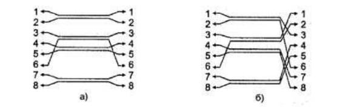
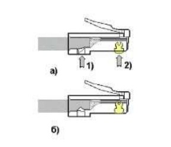
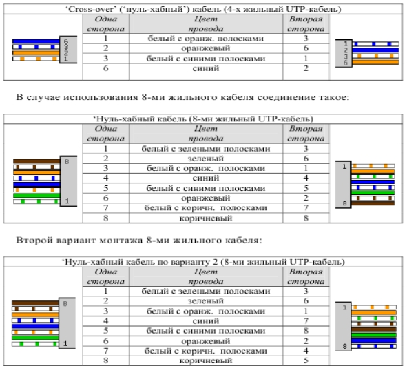

# 🖥️ Лабораторная работа №1
## Подключение персонального компьютера к локальной вычислительной сети

**Статус:** В работе  
**Дисциплина:** Сети и телекоммуникации  
**Стандарт:** Ethernet IEEE 802.3

---

## 👤 Информация о студенте

**ФИО:** Козлов Аптем  
**Группа:** Ипо8482

---

## 📦 Оборудование и материалы

| Компонент | Характеристики | Примечание |
|-----------|----------------|------------|
| Персональный компьютер | [Модель ПК] | IBM PC-совместимый |
| Сетевая карта (NIC) | [Модель] | Шина: [PCI / PCIe / Встроенная] |
| Кабель | UTP Cat [5 / 5e / 6] | Количество жил: [4 / 8] |
| Разъемы | RJ-45 (8P8C) | Количество шт.: [__] |
| Инструмент | [Модель обжимных щипцов] | Или отвертка (если вручную) |
| Тестер | [Модель тестера / Омметр] | Для проверки целостности |

---

## 📖 Теоретическая часть

### Кабель UTP и разъемы RJ-45

  
*Рис. 1.1 - Кабель UTP категории 5 (слева) и разъем RJ-45 (вилка и розетка)*

### Топология сети Ethernet

  
*Рис. 1.2 - Сеть 10BaseT/100BaseTX: а) звезда, б) непосредственное соединение двух компьютеров*

### Схемы обжима кабеля

  
*Рис. 1.3 - Интерфейсные кабели Ethernet: а) прямой, б) перекрестный (кроссовый)*

  
*Рис. 1.4 - Гальваническая развязка сетевых адаптеров*

---

## 🛠️ Инструменты и технология обжима

  
*Рис. 1.5 - Обжимной инструмент для разделки UTP-кабеля (а) и последовательность снятия внешней оболочки (б)*

### Схемы заделки проводов

  
*Рис. 1.6 - Варианты заделки проводов (схемы T568A и T568B)*

  
*Рис. 1.7 - Порядок обжима вилки RJ-45*

  
*Рис. 1.8 - Варианты монтажа 4-жильного кабеля*

---

## 📋 Задание к работе

**Выберите тип выполненного задания:**

- [ ] **Задание А:** Прямой кабель (Straight) для соединения ПК с коммутатором
- [ ] **Задание Б:** Перекрестный кабель (Cross-over) для соединения двух ПК

### Параметры кабеля

| Параметр | Значение |
|----------|----------|
| Тип обжима | [Прямой / Перекрестный] |
| Схема заделки (T568) | [A / B] (Рекомендуется B) |
| Длина кабеля | [______] см |
| Скорость передачи | [10 / 100 / 1000] Мбит/с |

---

## 🔌 Распиновка разъема RJ-45

### Конец №1 (Со стороны ПК)

| Пин | Цвет жилы | Пин | Цвет жилы |
|:---:|:----------|:---:|:----------|
| **1** | [__________] | **5** | [__________] |
| **2** | [__________] | **6** | [__________] |
| **3** | [__________] | **7** | [__________] |
| **4** | [__________] | **8** | [__________] |

### Конец №2 (Со стороны устройства/ПК)

| Пин | Цвет жилы | Пин | Цвет жилы |
|:---:|:----------|:---:|:----------|
| **1** | [__________] | **5** | [__________] |
| **2** | [__________] | **6** | [__________] |
| **3** | [__________] | **7** | [__________] |
| **4** | [__________] | **8** | [__________] |

---

## 💻 Сетевой адаптер

  
*Рис. 1.9 - Сетевая карта шины данных PCI: 1- разъем RJ-45, 2- светодиодный индикатор, 3- шина PCI, 4- панелька BootROM, 5- микросхема контроллера, 6- коннектор Remote Wake Up*

### Характеристики адаптера

*Для получения данных используйте команду `ipconfig /all`*

| Параметр | Значение |
|----------|----------|
| Модель адаптера | [Название из диспетчера устройств] |
| MAC-адрес (Физический) | [XX-XX-XX-XX-XX-XX] |
| Производитель (по MAC) | [Realtek / Intel / Cisco] |
| Адрес ввода-вывода (I/O) | [0x______] |
| Номер прерывания (IRQ) | [______] |
| Поддерживаемые скорости | [10/100/1000 Мбит/с] |

---

## 🌐 Проверка подключения

### 1. Конфигурация IP (ipconfig)

```
C:\Users\User> ipconfig /all

# Вставьте вывод команды ниже:
[_________________________________________________________________]
[_________________________________________________________________]
[_________________________________________________________________]
```

### 2. Проверка связи (ping)

```
C:\Users\User> ping [IP-адрес узла]
 
# Вставьте вывод команды ниже:
[_________________________________________________________________]
[_________________________________________________________________]
```

**Статистика:**
- Отправлено: 4
- Получено: [__]
- Потеряно: [__] ([__]%)
- Мин. время: [__] мс
- Макс. время: [__] мс
- Ср. время: [__] мс

### 3. Тестирование кабеля

| Индикатор | Статус | Примечание |
|:---------:|:------:|------------|
| 1 | [✅ / ❌] | [Если есть замыкание/обрыв] |
| 2 | [✅ / ❌] | |
| 3 | [✅ / ❌] | |
| 4 | [✅ / ❌] | |
| 5 | [✅ / ❌] | |
| 6 | [✅ / ❌] | |
| 7 | [✅ / ❌] | |
| 8 | [✅ / ❌] | |

---

## 📸 Фотоотчет

### Этап 1: Зачистка кабеля
  
*Фото 1 - Зачистка внешней оболочки кабеля на 12.5 мм*

### Этап 2: Расположение жил
  
*Фото 2 - Расположение жил в соответствии со схемой заделки*

### Этап 3: Установка жил в коннектор
  
*Фото 3 - Установка жил в разъем RJ-45 до упора*

### Этап 4: Обжим разъема
  
*Фото 4 - Обжим разъема RJ-45 специальным инструментом*

### Этап 5: Готовый кабель
  
*Фото 5 - Готовый обжатый кабель с двух сторон*

### Этап 6: Тестирование
  
*Фото 6 - Проверка кабеля тестером*

### Результаты ping
  
*Скриншот 1 - Результат проверки связи командой ping*

---

## ❓ Контрольные вопросы

<details>
<summary><strong>🔹 Нажмите, чтобы раскрыть вопросы</strong></summary>

**1. Какие сетевые кабели использует технология Ethernet? Что такое кабель UTP? В чем его достоинства и недостатки?**
> `[Ваш ответ]`

**2. Что такое сетевые устройства MDI и MDIX? Для соединения каких устройств необходим "перекрестный" (кроссированный) кабель?**
> `[Ваш ответ]`

**3. Почему при монтаже вилки RJ-45 на кабель нет необходимости снимать изоляцию с отдельных жил кабеля?**
> `[Ваш ответ]`

**4. Что такое "нуль-модемный" кабель и для каких целей он применяется?**
> `[Ваш ответ]`

**5. Каким образом однозначно идентифицируются сетевые адаптеры? С какой целью введена возможность изменения MAC-адреса?**
> `[Ваш ответ]`

**6. В чем заключается процесс конфигурирование сетевой платы? Какие параметры при этом настраиваются?**
> `[Ваш ответ]`

</details>

---

**Дата выполнения:** ______________  
**Подпись преподавателя:** ______________  
**Оценка:** ______________
