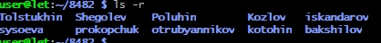
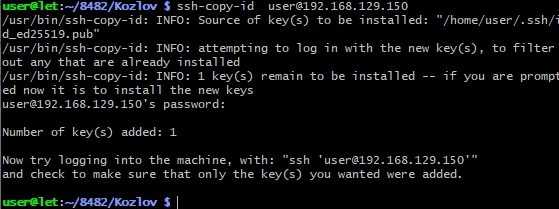

# Лабораторная работа: Подключение к Raspberry Pi по протоколу SSH

## 📋 Цель работы
Научиться подключаться к одноплатному компьютеру Raspberry Pi по SSH с использованием пароля и аутентификации по ключам, а также выполнить базовые операции с файловой системой.

---

## 🔹 ЧАСТЬ 1. Подключение по паролю и работа с файловой системой

### 1.1. Установка SSH-соединения
Для подключения к Raspberry Pi выполните команду в терминале:
```bash
ssh user@192.168.129.150
```

---

### 1.2. Создание каталогов и файлов
1. Перейдите в корневой каталог и откройте папку с номером вашей группы.
2. Внутри создайте каталог, названный вашей фамилией.
3. Выполните задание по созданию вложенных каталогов и файлов (согласно варианту/методичке).

Пример команд:
```bash
cd /
cd путь_к_папке_группы
mkdir Фамилия
cd Фамилия


---

### 1.3. Проверка структуры и отключение
Для рекурсивного вывода всей созданной структуры выполните:
```bash
ls -R
```


> 📷 *Вставьте скриншот с результатом выполнения ls -R*

Для завершения сессии SSH используйте команду:
```bash
exit
```


---

## 🔹 ЧАСТЬ 2. Настройка подключения по SSH-ключам

### 2.1. Проверка наличия существующих ключей
На **локальном ПК** проверьте директорию `.ssh`:
```bash
ls ~/.ssh
```
Если в выводе присутствуют `id_rsa.pub` или `id_dsa.pub` → ключи уже созданы, генерацию можно пропустить.


---

### 2.2. Генерация новой пары SSH-ключей
Если ключей нет, выполните:
```bash
ssh-keygen
```
- При запросе пути сохранения: нажмите `Enter` (по умолчанию `~/.ssh/`)
- При запросе пароля для защиты приватного ключа: оставьте пустым и нажмите `Enter`


Проверьте результат:
```bash
ls ~/.ssh
```
Должны появиться:
- `id_rsa` 🔒 приватный ключ (хранится на ПК)
- `id_rsa.pub` 🔓 публичный ключ (копируется на Raspberry Pi)

---

### 2.3. Копирование публичного ключа на Raspberry Pi
Используйте утилиту `ssh-copy-id` для автоматического добавления ключа в `~/.ssh/authorized_keys` на плате:
```bash
ssh-copy-id user@192.168.129.150
```
> 💡 При первом подключении будет запрошен пароль пользователя (`123`).



---

## Ответы на контрольные вопросы


## 1. Что такое командная строка?
**Командная строка (CLI)** — текстовый интерфейс для ввода команд пользователем, которые обрабатываются интерпретатором (bash, cmd, PowerShell). Позволяет управлять ОС без графического интерфейса.


---

## 2. Основные команды управления файлами

| Действие | Linux/Unix | Windows |
|----------|-----------|---------|
| Список файлов | `ls [-la]` | `dir` |
| Смена каталога | `cd путь` | `cd путь` |
| Создать папку | `mkdir имя` | `mkdir имя` |
| Удалить файл | `rm файл` | `del файл` |
| Удалить папку | `rm -r папка` | `rmdir /s папка` |
| Копировать | `cp от куда куда` | `copy от куда куда` |
| Переместить | `mv от куда куда` | `move от куда куда` |
| Просмотр файла | `cat файл` | `type файл` |

---

## 3. Команды вывода информации о системе

**Linux:**
```bash
uname -a      # Версия ядра
hostname      # Имя хоста
whoami        # Пользователь
free -h       # ОЗУ
df -h         # Место на диске
ps aux        # Процессы
ip a          # Сетевые интерфейсы
top           # Мониторинг ресурсов
```

**Windows:** `systeminfo`, `whoami`, `tasklist`, `ipconfig`

---

## 4. Команды ввода/вывода файлов

```bash
cat файл          # Вывод содержимого
less файл         # Постраничный просмотр
head/tail -n 10   # Первые/последние 10 строк
echo "текст" > ф  # Запись в файл (перезапись)
echo "текст" >> ф # Дописать в файл
grep "текст" ф    # Поиск по файлу

# Перенаправление и конвейеры:
команда > файл    # Вывод в файл
команда | grep х  # Фильтрация вывода
```

---

## 5. Возможно ли полноценное управление системой только через командную строку?

**✅ Да.** 

**Обоснование:**
- Все системные вызовы доступны через CLI
- Серверы часто работают без графического интерфейса (Headless)
- Скрипты позволяют автоматизировать любые задачи
- Удалённое администрирование (SSH) работает только с CLI
- Аварийное восстановление системы возможно только через консоль


---

## 6. Отличия командной строки Windows от MS-DOS

| Критерий | MS-DOS | Windows CMD |
|----------|--------|-------------|
| Архитектура | 16-бит, однозадачная | 32/64-бит, многозадачная (NT) |
| Файловая система | FAT12/16 | NTFS, FAT32, exFAT |
| Команды | Встроенные в COMMAND.COM | Внешние .exe + API |
| Скриптинг | Простые .bat | .bat, .cmd, PowerShell |
| Сеть | Отсутствует | Полная поддержка TCP/IP |
| Кодировка | ASCII | Unicode |


---

## 7. Интерпретаторы команд в других ОС

| ОС | Интерпретаторы | Особенности |
|----|---------------|-------------|
| Linux | `bash`, `zsh`, `fish` | Скриптинг, автодополнение, плагины |
| macOS | `zsh` (по умолчанию) | Интеграция с Unix-утилитами |
| BSD | `sh`, `tcsh`, `csh` | Стандарты POSIX, безопасность |
| Android | `sh`, `bash` (Termux) | Адаптированные Linux-утилиты |
----
Вариант 8


---

Ответы на вопросы
1. Что такое командная строка?
Командная строка (терминал, shell, командный интерпретатор) — это текстовый интерфейс для взаимодействия пользователя с операционной системой. В отличие от графического интерфейса (GUI), где команды выполняются через клики мышью, в командной строке пользователь вводит текстовые команды.

Основные характеристики:

Текстовый ввод команд
Быстрое выполнение операций
Автоматизация через скрипты
Минимальное потребление ресурсов
Мощные возможности для администрирования
2. Основные команды управления файлами в командной строке
Команда Описание Пример
ls Список файлов и директорий ls -la
cd Смена директории cd /home/user
pwd Показать текущую директорию pwd
cp Копирование файлов cp file1 file2
mv Перемещение/переименование mv old.txt new.txt
rm Удаление файлов rm -rf directory
mkdir Создание директории mkdir new_folder
rmdir Удаление пустой директории rmdir folder
touch Создание пустого файла touch file.txt
chmod Изменение прав доступа chmod 755 script.sh
chown Изменение владельца chown user:group file
3. Команды вывода основной информации системы
Команда Описание
uname -a Информация о ядре и системе
hostname Имя хоста
whoami Текущий пользователь
date Текущая дата и время
uptime Время работы системы
free -h Информация о памяти
df -h Информация о дисковом пространстве
cat /etc/os-release Информация о дистрибутиве
lscpu Информация о процессоре
ps aux Список процессов
top / htop Мониторинг системы в реальном времени
4. Команды ввода/вывода файлов
Команда Описание
cat file Вывод содержимого файла
less file Постраничный просмотр файла
more file Постраничный просмотр (базовый)
head file Первые строки файла
tail file Последние строки файла
nano file / vim file Редактирование файла
echo "text" > file Запись текста в файл (перезапись)
echo "text" >> file Добавление текста в файл
grep "pattern" file Поиск текста в файле
wc file Подсчёт строк, слов, символов
5. Возможно ли полноценное управление системой, пользуясь только командной строкой?
Да, возможно и даже необходимо для профессиональной работы!

Обоснование:

✅ Полный контроль над системой:

Установка и настройка ПО (apt, yum, dnf)
Управление пользователями и правами
Настройка сети и брандмауэра
Управление службами (systemctl)
Монтирование файловых систем
Резервное копирование и восстановление

✅ Преимущества CLI:

Автоматизация: скрипты bash, cron
Удалённое администрирование: SSH
Экономия ресурсов: нет графической оболочки
Мощность: конвейеры (pipes), перенаправление
Воспроизводимость: логирование команд

✅ Реальные сценарии:

Серверы работают без GUI (экономия ресурсов)
Экстренное восстановление системы
DevOps и CI/CD процессы
Облачные инфраструктуры
Пример: Большинство веб-серверов, баз данных и облачных серверов управляются исключительно через CLI.

6. Отличия командной строки Windows от MS-DOS
Несмотря на внешнюю схожесть, это принципиально разные системы:

Аспект MS-DOS Windows CMD
Архитектура 16-битная ОС 32/64-битное приложение Win32
Внутренности Сама ОС Оболочка поверх Windows API
Команды Внутренние команды DOS Команды Windows + вызовы API
Скрипты .bat файлы .bat, .cmd, PowerShell
Пути C:\DIR\FILE C:\Users\Name (UNC пути)
Доступ к системе Прямой доступ к железу Через защищённое пространство
Многозадачность Нет (однопоточная) Есть (многопоточность Windows)
Ключевое отличие:

MS-DOS — это самостоятельная операционная система
CMD.exe — это приложение, работающее внутри Windows, использующее её API и службы
Современная альтернатива: Windows PowerShell и Windows Terminal предоставляют гораздо больше возможностей, чем классический CMD.

7. Интерпретаторы команд в других операционных системах
Unix/Linux системы:
Shell Описание
Bash (Bourne Again Shell) Стандарт для большинства дистрибутивов Linux
Zsh (Z Shell) Современная оболочка с автодополнением (macOS default с 10.15)
Fish (Friendly Interactive Shell) Удобный интерактивный shell
Ksh (Korn Shell) Продвинутый shell для скриптов
Tcsh Улучшенная версия C Shell
Dash Лёгкий
| Windows | `cmd`, `PowerShell` | Работа с .NET-объектами |
| Сетевое ПО | Cisco IOS, MikroTik CLI | Специализированные команды |

---
